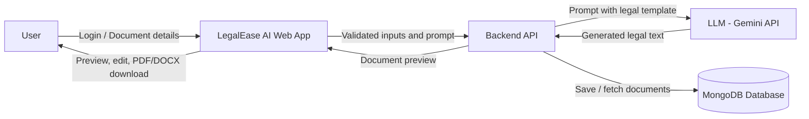

# Data Flow Diagram & User Stories

| Field         | Details                                                   |
| ------------- | --------------------------------------------------------- |
| Project Title | LegalEase AI: AI-Powered Legal Document Generator         |
| Team ID       | SWTID-2026-5104                                           |
| Team Size     | 5                                                         |
| Team Leader   | Priyadharsini L                                           |
| Team Members  | Deepa Dharshini D, Naveen Kumar, Tamilselvan, Vinothini P |

---

## Data Flow Diagram (Level 0)

## Data Flow Summary

| Flow No. | Source      | Data                             | Destination      |
| -------- | ----------- | -------------------------------- | ---------------- |
| DF-1     | User        | Registration / login credentials | Backend API      |
| DF-2     | User        | Document type and form inputs    | Backend API      |
| DF-3     | Backend API | Structured prompt                | LLM (Gemini API) |
| DF-4     | LLM         | Generated document text          | Backend API      |
| DF-5     | Backend API | Document record                  | MongoDB Database |
| DF-6     | Backend API | Preview text and export file     | User             |

## User Stories

| User Type           | Functional Requirement (Epic) | User Story Number | User Story / Task                                                                        | Acceptance Criteria                          | Priority | Release  |
| ------------------- | ----------------------------- | ----------------- | ---------------------------------------------------------------------------------------- | -------------------------------------------- | -------- | -------- |
| Customer (Web User) | Registration                  | USN-1             | As a user, I can register with email and password so that I can access the application   | Account is created and confirmation is shown | High     | Sprint-1 |
| Customer (Web User) | Login                         | USN-2             | As a user, I can log in so that I can access my dashboard                                | Valid credentials open the dashboard         | High     | Sprint-1 |
| Customer (Web User) | Document Selection            | USN-3             | As a user, I can choose a document type so that I get a relevant form                    | Selected type loads the correct form         | High     | Sprint-2 |
| Customer (Web User) | Input Form                    | USN-4             | As a user, I can fill in party names, dates and terms so that the document is customised | Invalid or empty fields show errors          | High     | Sprint-2 |
| Customer (Web User) | AI Generation                 | USN-5             | As a user, I can generate a legal document with one click so that I save time            | Document is generated within 15 seconds      | High     | Sprint-2 |
| Customer (Web User) | Preview and Edit              | USN-6             | As a user, I can preview and edit the document so that I can correct details             | Edits are reflected in the final file        | Medium   | Sprint-3 |
| Customer (Web User) | Export                        | USN-7             | As a user, I can download the document as PDF or DOCX so that I can use it offline       | File downloads with correct formatting       | High     | Sprint-3 |
| Customer (Web User) | History                       | USN-8             | As a user, I can view my saved documents so that I can reuse them                        | History list shows all saved documents       | Medium   | Sprint-3 |
| Customer (Web User) | Clause Explanation            | USN-9             | As a user, I can read simple explanations of clauses so that I understand what I sign    | Explanation appears for each major clause    | Medium   | Sprint-4 |
| Administrator       | Template Management           | USN-10            | As an admin, I can add or update document templates so that new types are supported      | New template appears in the selection list   | Low      | Sprint-4 |
