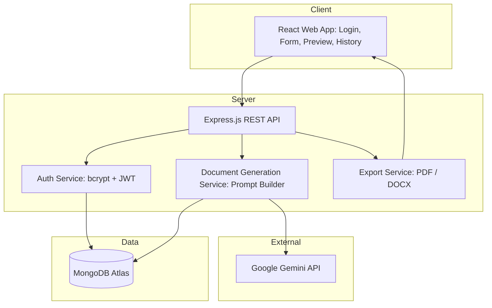

# Solution Architecture

| Field         | Details                                                   |
| ------------- | --------------------------------------------------------- |
| Project Title | LegalEase AI: AI-Powered Legal Document Generator         |
| Team ID       | SWTID-2026-5104                                           |
| Team Size     | 5                                                         |
| Team Leader   | Priyadharsini L                                           |
| Team Members  | Deepa Dharshini D, Naveen Kumar, Tamilselvan, Vinothini P |

---

## Architecture Diagram

## Architecture Components

| S.No | Layer        | Component              | Responsibility                                 | Technology                   | Owner             |
| ---- | ------------ | ---------------------- | ---------------------------------------------- | ---------------------------- | ----------------- |
| 1    | Presentation | Web UI                 | Forms, live preview, editor, history dashboard | React.js, CSS                | Deepa Dharshini D |
| 2    | Application  | REST API               | Routing, validation, error handling            | Node.js, Express.js          | Naveen Kumar      |
| 3    | Application  | Auth Service           | Registration, login, token handling            | bcrypt, JWT                  | Naveen Kumar      |
| 4    | AI           | Generation Service     | Build prompts from templates and call the LLM  | Gemini API, prompt templates | Tamilselvan       |
| 5    | Application  | Export Service         | Convert final text into PDF and DOCX           | jsPDF, docx                  | Vinothini P       |
| 6    | Data         | Database               | Users, templates and generated documents       | MongoDB Atlas                | Priyadharsini L   |
| 7    | Quality      | Validation and Testing | Input checks, disclaimer, test suite           | Jest, Postman                | Vinothini P       |

## Request Flow

| Step | Action                                                                     |
| ---- | -------------------------------------------------------------------------- |
| 1    | User logs in and selects a document type                                   |
| 2    | UI collects inputs and sends them to the API                               |
| 3    | API validates inputs and builds a prompt using the matching legal template |
| 4    | Gemini API returns the generated document text                             |
| 5    | API saves the document in MongoDB and returns a preview                    |
| 6    | User edits if needed and downloads the PDF or DOCX                         |
